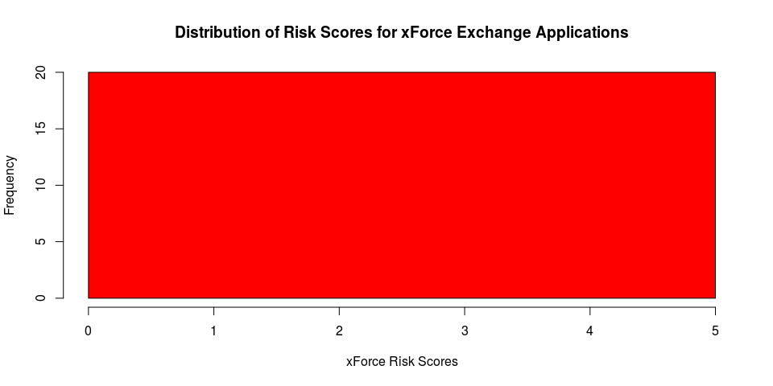

# Distribution of Application Risk Scores in IBM X-Force Exchange 
### Author:  Brian Matthiesen
### November 2015
_ _ _

<a name="top-page"/>  

## Table of Contents
* [Synopsis](#synopsis)
* [Data Processing](#processing)
* [Results](#results)
    * [Distribution of Risk Scores](#riskdist)
* [Conclusion](#conclusion)

_ _ _ _ _ _ _ _ _ _ _

<a name="synopsis"/>

## Synopsis
In this report we aim to describe the distribution of Internet Application Profile (IAP) Risk Scores within the IBM X-Force Exchange service. Our hypothesis is that the bulk of the applications are clustered within a narrow band of scores at the low end of the range with relatively few high-risk applications at the margin. To investigate this hypothesis, we obtained data on Application (IAP) entries in X-Force Exchange via the public API. From these data we found that the bulk of the application risk scores are in the range of 2 to 4.  

[[Top](#top-page)]

_ _ _ _ _ _ _ _ _ _ _

<a name="processing"/>

## Data Processing
This section describes the source and the preparation of data for the analysis. 
We begin by preparing the R environment by clearing the environment and loading library packages used by this analysis. 
  

```r
rm(list=ls())
library(ggplot2)
library(RCurl)
library(jsonlite)
library(dplyr)
library(knitr)
```
  
The data for this analysis comes from the IBM X-Force Exchange service. (exchange.xforce.ibmcloud.com). 
The Internet Application Profile (IAP) are available via a RESTful interface and are returned as JSON objects.   
  

```r
# Get the authorization token from xForce Exchange. Save the token in the curl
# options for use on all xForce API calls.

xfe_auth = fromJSON(getURL("https://xforce-api.mybluemix.net/auth/anonymousToken"))
curl.opts <- list(httpheader = c("Accept-Language" = "en-US",
                                 "Authorization" = paste("Bearer", xfe_auth$token),
                                 "Accept" = "application/json"))

# Call xForce to return the list of all known applications in JSON format.
# JASON key "canonicalNames" holds the list of application names.

appList <- fromJSON(getURL("https://api.xforce.ibmcloud.com/app/",
                           .opts = curl.opts))
```
  
Now that the data are loaded, let's review some of the characteristics of the Application List (IAP). 
The number of Applications found in X-Force is 1331.  We also show the first 10 applications.
  

```r
length(appList[[1]])
```

```
## [1] 1331
```

```r
head(appList[[1]],10)
```

```
##  [1] "@creatorz"      "@flab"          "@nifty"         "@paint"        
##  [5] "1-2-sports.com" "1&1 smartdrive" "115"            "11st"          
##  [9] "123rf"          "1click4you.com"
```

  
We are interested in the Risk Score for each application. These data are contained in the Application Details. 
We call the X-Force API to retrieve these scores along with additional data such as application category and known risks.  
  

```r
# Create the final receiving data frame to be used in plotting and loop through
# the list of applications known to xForce, retrieving details for each
# application. Set application risk to "5" if it is missing from xForce.

appData <- data.frame()

for (appName in appList$canonicalNames[1:20]) {
    # Replace spaces in URLs  
    appName <- gsub(" ", "%20", appName)        
    
    # Call xForce to pull the app details
    appDetail <- fromJSON(getURL(paste0("https://xforce-api.mybluemix.net/app/", 
                                        appName), .opts = curl.opts))
    
    # Replace missing risk scores with "5.0"
    if (is.null(appDetail$application$score)) {
        appDetail$application$score <- "5"
    }
    
    # Accumulate the data table for plotting.
    # Note that JSON keys map to R "name" when using fromJSON function.
    appData <- rbind(appData, matrix(list(
                                "Application",
                                appDetail$application$name,
                                appDetail$application$description,
                                names(appDetail$application$categories),
                                names(appDetail$application$actions),
                                names(appDetail$application$rlfs),
                                as.numeric(appDetail$application$score)),
                                nrow = 1, ncol = 7))
}

# Add column names to make it easier to work with.
colnames(appData) <- list("Type", "Name", "Description", "Categories", "Actions", "Rilfs", "Score")
```
  
Now that the Application Detail data are loaded, let's review some of the characteristics.
We first list a few applications and their risk scores, then a full IAP entry showing category and other data.
  

```r
head(appData[, c(2,7)],20)
```

```
##    Name Score
## 1  NULL     5
## 2  NULL     5
## 3  NULL     5
## 4  NULL     5
## 5  NULL     5
## 6  NULL     5
## 7  NULL     5
## 8  NULL     5
## 9  NULL     5
## 10 NULL     5
## 11 NULL     5
## 12 NULL     5
## 13 NULL     5
## 14 NULL     5
## 15 NULL     5
## 16 NULL     5
## 17 NULL     5
## 18 NULL     5
## 19 NULL     5
## 20 NULL     5
```

```r
appData[1,]
```

```
##          Type Name Description Categories Actions Rilfs Score
## 1 Application NULL        NULL       NULL    NULL  NULL     5
```

_ _ _ _ _ _ _ _ _ _ _
<a name="result"/>

## Results

<a name="riskdist"/>

### Distribution of Risk Scores
After collecting all Application (IAP) data, we can summarize the statistics of the Risk Score.
We also plot a histogram of the Risk Score distribution.


```r
# Summarize the statistics of the risk scores. 
x <- as.vector(appData$Score, mode="numeric")
summary(x)
```

```
##    Min. 1st Qu.  Median    Mean 3rd Qu.    Max. 
##       5       5       5       5       5       5
```

```r
# Plot the histogram of xForce risk scores. 
h <- hist(x, breaks=10, col="red", xlab="xForce Risk Scores", 
          main="Distribution of Risk Scores for xForce Exchange Applications")

# Add a distribution curve.
xfit <-seq(min(x),max(x),length=40) 
yfit <-dnorm(xfit,mean=mean(x),sd=sd(x)) 
yfit <- yfit*diff(h$mids[1:2])*length(x) 
lines(xfit, yfit, col="blue", lwd=2)
```

 
[[Top](#top-page)]   
   
_ _ _ _ _ _ _ _ _ _ _
<a name="recommend"/>

## Recommendations
The data support our hypothesis that the bulk of the applications are clustered within a narrow band of scores at the low end of the range with relatively few high-risk applications at the margin. The data are distributed with a median of 5 with a few high-risk applications with a maximum of 5. 


[[Top](#top-page)]  
